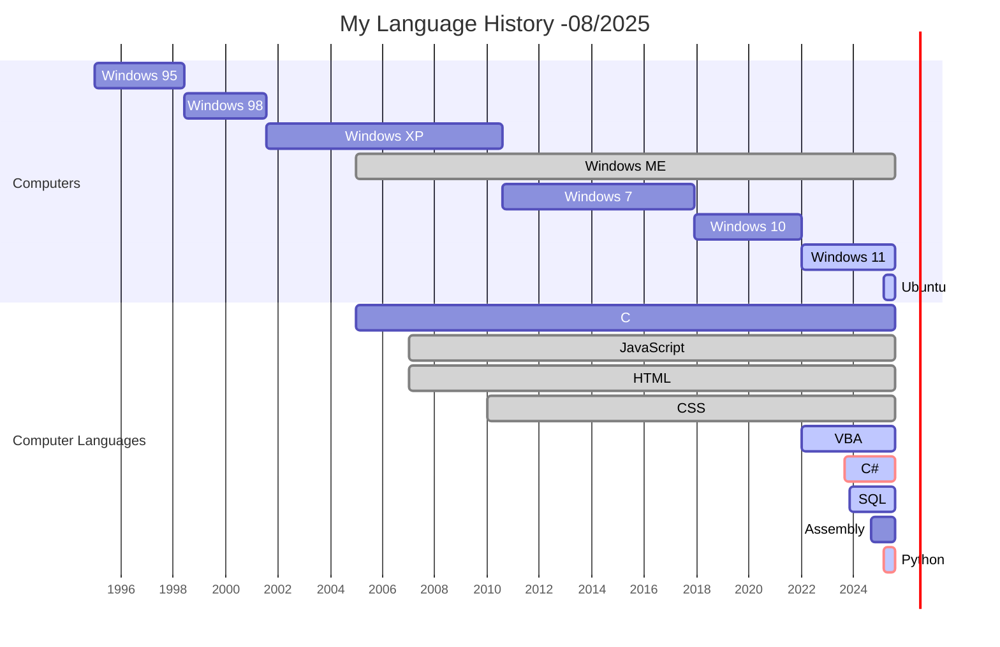

# Hello There!! :wave:

```text

             .c""''``                                
          :'oh;"'`
      ,  :;""'                                 ::::::::::::::n,
      '"ssi;:"                                 "::::M^^^^^\::::M
   ,;:ssOoo,                                    ::::M      :::::M                                   :::m
  `"ssiOOo"                                     ::::M      ;::;M                                     ':V
 ,.--====-..                  ,;+ynhhnzqy       :::::..,,;::;M"                                      '^    ......_
   'i:::iilll             ,;sw+*"'      `       ::::M^^^T:::L       ::::M      ::::A  ::::M   :::A        ::v^^\::A
    ::iiddSSH         ,;.:sW*                   ::::M    T:::L        ::.L     :::W   `:::M   :::M        ':...,`^^
    "::idddSHl,.  , ",SOW*                      ::::M     T::::L      `::ML   :::W     :::M   :::M         `"""`;::\
    ':ilddSSHHi,..:iSB*^                        ::::M      T::::::A     ::.L :::W      `::::..;::.A       ::.....;:;N
 b   ":iiddSHnihhOOW*                           "^^^^       `^^^^^^^     `:::::W        `^^^^^^^^^"       `^^^^^^^^
  b  `::iddhhhMV+*                                                       ,;:::W
    `'''"""'                                                         ;::::::w/
                                                                     `^^^^^^

                              # RELAX AND ENJOY THE STORIES #

```

## About Me :floppy_disk:

&nbsp;&nbsp;&nbsp;&nbsp;Hi! I'm Ryuji &mdash; a programmer who grew up with C. The third generation of the coding family. I lived through my teenage years with BCC Developer and HTML code edited with Notepad in Windows.  
&nbsp;&nbsp;&nbsp;&nbsp;From Intel 8085 Assembly to Python, I explore both the *Past* and the *Future* of computing.



## Current Focus :wrench:

- Building reusable AI models with clear logic and structure
- Exploring the connection between “vibe coding” and traditional “legacy code”
- Creating some personal tools

## My Philosophy :mage_man:

- Coding is not just work; it is a creation and an art.
- I code like bleath, debug like walk.

<!--
**Ryuji-Hazama/Ryuji-Hazama** is a ✨ _special_ ✨ repository because its `README.md` (this file) appears on your GitHub profile.

Here are some ideas to get you started:

- 🔭 I’m currently working on ...
- 🌱 I’m currently learning ...
- 👯 I’m looking to collaborate on ...
- 🤔 I’m looking for help with ...
- 💬 Ask me about ...
- 📫 How to reach me: ...
- 😄 Pronouns: ...
- ⚡ Fun fact: ...
-->
